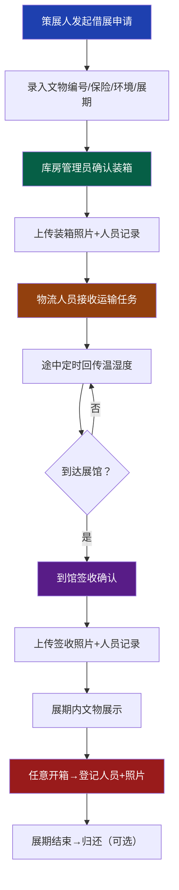

## 1. 产品概述

博物馆文物借展物流平台是一款面向博物馆内部多角色协作及外部展馆参与的文物借展全流程管理系统。系统覆盖从策展人发起借展申请、库房装箱确认、物流温湿度追踪、到馆签收、开箱记录到外部展馆状态查询的完整链路，确保文物在借展过程中的安全可追溯。

- **目标用户**：策展人、库房管理员、物流人员、外部展馆工作人员
- **核心价值**：文物借展全程可视化、物流环境实时监控、开箱操作留痕可追溯、外部展馆数据隔离

## 2. 核心功能

### 2.1 用户角色

| 角色 | 注册方式 | 核心权限 |
|------|----------|----------|
| 策展人 | 系统分配账号 | 发起借展申请、录入文物信息、查看全部借展状态、查看仪表盘 |
| 库房管理员 | 系统分配账号 | 确认装箱、查看待装箱列表、记录开箱操作 |
| 物流人员 | 系统分配账号 | 回传温湿度数据、到馆签收确认、运输途中记录开箱 |
| 外部展馆 | 系统分配账号 | 仅查看本展馆借到的文物状态、签收确认、记录开箱 |

### 2.2 功能模块

1. **登录页面**：角色选择登录、账号密码验证
2. **仪表盘总览**：借展统计、在途文物、环境告警、流程进度
3. **借展管理**（策展人）：发起借展、借展列表、详情查看
4. **库房管理**（库房管理员）：待装箱列表、装箱确认、开箱记录
5. **物流追踪**（物流人员）：运输任务、温湿度上报、到馆签收
6. **开箱记录**：全角色开箱登记（人员+照片+时间+原因）
7. **外部展馆视图**：仅展示本展馆借到的文物及物流状态

### 2.3 页面详情

| 页面名称 | 模块名称 | 功能描述 |
|----------|----------|----------|
| 登录页 | 角色选择 | 四种角色切换登录，输入账号密码 |
| 登录页 | 品牌展示 | 平台Logo、名称、装饰背景 |
| 仪表盘 | 统计卡片 | 总借展数、在途数、待装箱、已签收、告警数 |
| 仪表盘 | 流程进度条 | 展示各借展流程节点完成情况 |
| 仪表盘 | 环境监控 | 实时温湿度图表、异常告警列表 |
| 借展发起页 | 表单录入 | 文物编号、保险金额、环境要求（温湿度范围）、展期起止、目标展馆、备注 |
| 借展列表页 | 列表展示 | 筛选、搜索、状态标签、操作按钮 |
| 借展详情页 | 时间线 | 全流程节点时间线，含操作人和时间 |
| 借展详情页 | 环境数据 | 温湿度历史折线图 |
| 借展详情页 | 开箱记录 | 开箱历史表格，含人员、照片、原因 |
| 库房装箱页 | 待装箱列表 | 展示待确认装箱的借展申请 |
| 库房装箱页 | 装箱确认 | 录入装箱人、装箱时间、上传装箱照片、生成装箱单 |
| 物流任务页 | 在途列表 | 展示负责的运输任务 |
| 物流任务页 | 温湿度上报 | 录入温度、湿度、上报时间，支持批量上报 |
| 物流任务页 | 到馆签收 | 录入签收人、签收时间、上传签收照片、物品完好确认 |
| 开箱登记页 | 开箱表单 | 开箱人员、开箱时间、开箱原因、现场照片上传 |
| 外部展馆首页 | 文物列表 | 仅展示本展馆借到的文物，不可查看其他展馆数据 |

## 3. 核心流程

### 3.1 借展主流程
策展人发起借展申请（录入文物信息、保险金额、环境要求、展期）→ 库房管理员确认装箱（上传装箱照片）→ 物流人员接收任务，途中定时回传温湿度数据 → 到达后外部展馆或物流人员签收确认 → 任意环节开箱均需登记人员和照片 → 展期结束后文物归还（可选流程）。

### 3.2 开箱记录流程
任意角色在任意环节需要开箱时，必须登录系统登记开箱人员、开箱原因，上传现场照片后方可进行操作，系统自动记录时间戳和操作日志。

## 4. 用户界面设计

### 4.1 设计风格
- **主色调**：深墨青 `#0f3b3a` 作为主色，体现文博行业的厚重与专业
- **辅助色**：古铜金 `#c9a962` 点缀，呼应文物质感
- **强调色**：朱红 `#b91c1c` 用于告警和重要操作
- **背景色**：暖米白 `#faf8f5` 搭配深木纹纹理
- **按钮风格**：圆角矩形，微立体感，hover时有光泽过渡
- **字体**：标题用「思源宋体」体现文化底蕴，正文用「思源黑体」保证可读性
- **布局风格**：左侧导航栏 + 顶部状态栏 + 主内容区卡片式布局
- **图标风格**：线性图标配古铜金色，保持简洁庄重

### 4.2 页面设计概览

| 页面名称 | 模块名称 | UI元素 |
|----------|----------|--------|
| 登录页 | 品牌展示 | 深墨青渐变背景、古铜金文字、文物纹样装饰、柔和光晕动效 |
| 登录页 | 登录表单 | 半透明白色卡片、毛玻璃效果、角色切换Tab、古铜金按钮 |
| 仪表盘 | 统计卡片 | 深浅对比卡片、数字大字号、微动效hover、古铜金数据点缀 |
| 仪表盘 | 环境图表 | 平滑折线图、温湿度双轴、异常点红色标记 |
| 仪表盘 | 流程时间线 | 竖线连接节点、完成态打勾、进行态脉冲动画 |
| 借展表单 | 表单区域 | 分栏布局、输入框下划线风格、标签居左、必填项朱红标记 |
| 列表页 | 数据表格 | 斑马纹、状态标签圆角、操作按钮悬浮出现 |
| 详情页 | 时间线 | 左右交错时间线、节点带图标、照片缩略图预览 |
| 开箱登记 | 照片上传 | 拖拽上传区域、照片网格预览、删除标记 |

### 4.3 响应式
- 采用桌面端优先设计，最小支持宽度 1280px
- 侧边栏在 1024px 以下折叠为图标模式
- 表格在移动端可横向滚动
- 照片上传区自适应网格布局

### 4.4 动效细节
- 页面进入时卡片依次淡入上滑（stagger animation）
- 状态切换时有平滑过渡动画
- 按钮hover时轻微上浮并出现光泽
- 告警项有微弱呼吸闪烁效果
- 时间线节点完成时有打勾动画
