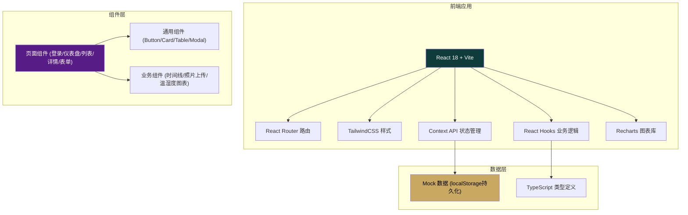

## 1. 架构设计



## 2. 技术说明

- **前端框架**：React 18 + TypeScript
- **构建工具**：Vite 5
- **样式方案**：TailwindCSS 3.4 + CSS Variables（主题定制）
- **路由管理**：React Router 6
- **状态管理**：React Context API + useReducer
- **图表组件**：Recharts（温湿度折线图、统计图表）
- **图标方案**：Lucide React
- **数据持久化**：localStorage 存储 Mock 数据
- **数据模拟**：内置完整 Mock 数据，无需后端

## 3. 路由定义

| 路由路径 | 页面用途 | 权限角色 |
|----------|----------|----------|
| `/login` | 登录页面（角色选择） | 公开 |
| `/dashboard` | 仪表盘总览 | 策展人、库房、物流 |
| `/exhibitions` | 借展列表 | 策展人、库房、物流 |
| `/exhibitions/new` | 发起新借展 | 策展人 |
| `/exhibitions/:id` | 借展详情页 | 全部角色（外部展馆仅看自己的） |
| `/warehouse` | 库房装箱管理 | 库房管理员 |
| `/logistics` | 物流任务管理 | 物流人员 |
| `/unpacking` | 开箱记录登记 | 全部角色 |
| `/external` | 外部展馆首页 | 外部展馆 |

## 4. 数据模型

### 4.1 实体关系图

```mermaid
erDiagram
    USER ||--o{ EXHIBITION : "策展人发起"
    EXHIBITION ||--|| PACKING_RECORD : "装箱记录"
    EXHIBITION ||--o{ ENVIRONMENT_LOG : "温湿度记录"
    EXHIBITION ||--o{ UNPACKING_RECORD : "开箱记录"
    EXHIBITION ||--|| SIGN_RECORD : "签收记录"
    EXHIBITION }o--|| MUSEUM : "目标展馆"
    
    USER {
        string id PK
        string username
        string role
        string name
        string museum_id FK
    }
    
    EXHIBITION {
        string id PK
        string artifact_no
        string artifact_name
        decimal insurance_amount
        decimal temp_min
        decimal temp_max
        decimal humidity_min
        decimal humidity_max
        date start_date
        date end_date
        string status
        string curator_id FK
        string museum_id FK
        datetime created_at
    }
    
    PACKING_RECORD {
        string id PK
        string exhibition_id FK
        string packer_name
        datetime packed_at
        string[] photos
        string remark
    }
    
    ENVIRONMENT_LOG {
        string id PK
        string exhibition_id FK
        decimal temperature
        decimal humidity
        datetime recorded_at
        string operator_id FK
        string location
    }
    
    UNPACKING_RECORD {
        string id PK
        string exhibition_id FK
        string operator_name
        string reason
        datetime unpacked_at
        string[] photos
    }
    
    SIGN_RECORD {
        string id PK
        string exhibition_id FK
        string receiver_name
        datetime signed_at
        string[] photos
        boolean is_good_condition
        string remark
    }
    
    MUSEUM {
        string id PK
        string name
        string address
        string contact
    }
```



### 4.2 状态枚举

| 实体 | 状态值 | 说明 |
|------|--------|------|
| EXHIBITION | `pending_packing` | 待装箱 |
| EXHIBITION | `packed` | 已装箱待运输 |
| EXHIBITION | `in_transit` | 运输中 |
| EXHIBITION | `delivered` | 已送达待签收 |
| EXHIBITION | `signed` | 已签收展期内 |
| EXHIBITION | `returning` | 归还中 |
| EXHIBITION | `completed` | 已完成 |

### 4.3 角色枚举

| 角色值 | 中文名 | 说明 |
|--------|--------|------|
| `curator` | 策展人 | 可发起借展、查看全部数据 |
| `warehouse` | 库房管理员 | 装箱确认、开箱登记 |
| `logistics` | 物流人员 | 温湿度上报、运输签收 |
| `external` | 外部展馆 | 仅看本展馆数据、签收、开箱登记 |

## 5. 核心目录结构

```
src/
├── assets/              # 静态资源
│   └── images/          # 图片资源
├── components/          # 通用组件
│   ├── ui/              # 基础UI组件
│   │   ├── Button.tsx
│   │   ├── Card.tsx
│   │   ├── Input.tsx
│   │   ├── Modal.tsx
│   │   ├── Table.tsx
│   │   └── Tag.tsx
│   ├── layout/          # 布局组件
│   │   ├── Sidebar.tsx
│   │   ├── Header.tsx
│   │   └── AppLayout.tsx
│   └── business/        # 业务组件
│       ├── Timeline.tsx
│       ├── PhotoUpload.tsx
│       ├── EnvironmentChart.tsx
│       └── StatusBadge.tsx
├── context/             # 状态管理
│   ├── AuthContext.tsx
│   └── ExhibitionContext.tsx
├── data/                # Mock数据
│   └── mockData.ts
├── pages/               # 页面组件
│   ├── Login.tsx
│   ├── Dashboard.tsx
│   ├── ExhibitionList.tsx
│   ├── ExhibitionNew.tsx
│   ├── ExhibitionDetail.tsx
│   ├── Warehouse.tsx
│   ├── Logistics.tsx
│   ├── Unpacking.tsx
│   └── ExternalMuseum.tsx
├── types/               # TypeScript类型
│   └── index.ts
├── utils/               # 工具函数
│   ├── format.ts
│   └── storage.ts
├── App.tsx
├── main.tsx
└── index.css
```
